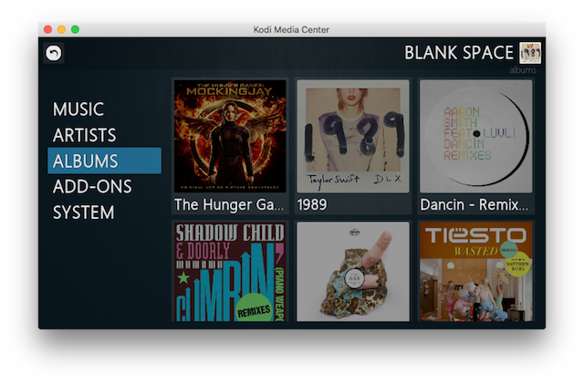

# kodi-repository

Kodi repository for skins and plugins adapted for working on my E83 X3 (2008), running a Raspberry PI via the [Pibus board](http://pius.infzo).

## Mimic XS

Skin adapted to the small screen of the X3.

The included `Mimic.xs Skinbackup.zip` in the `skin.mimic.xs` folder is a great set of defaults for this skin. It is also used in the screenshot.

Install the Skin Helper Skinbackup addon via the theme and put the zip in `~/.kodi/userdata/addon_data/script.skin.helper.skinbackup`. You might have to make a backup first and use that filename for the included backup.
